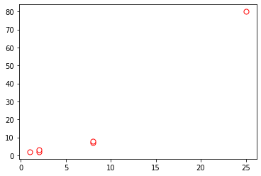

# DBScan Clustering Sample

*Created By: Debasis Das (26-Aug-2021)*

In this post we will generate a DBScan cluster using SKLearn DBSCAN module and will generate the following

1. List of noise/outlier points (not readily available in DBSCAN model output)
2. Index of noise/outlier points
3. View the clusters by cluster label and identify all the core points in the clusters
4. All the core points, count of core point, indexes of the core points
5. Estimated number of clusters
6. Silhouette Score of the Clustering
7. Silhouette Score of the Clustering by ignoring the noise points

Note: the noise points are those with label -1


```python
import numpy as np
from sklearn.cluster import DBSCAN
from sklearn.metrics import silhouette_samples, silhouette_score
import matplotlib.pyplot as plt

epsilon = 3
min_samples = 2

X = [
[1,2],
[2,2],
[2,3],
[8,7],
[8,8],
[25,80]]

# plot
A = np.array(X)
plt.scatter(
   A[:, 0], A[:, 1],
   c='white', marker='o',
   edgecolor='red', s=50
)
print("The points prior to running DBScan Clustering")
plt.show()


db = DBSCAN(eps=epsilon, min_samples=min_samples).fit(X)

core_samples_mask = np.zeros_like(db.labels_, dtype=bool)
core_samples_mask[db.core_sample_indices_] = True
labels = db.labels_
no_clusters = len(np.unique(labels) )
no_noise = np.sum(np.array(labels) == -1, axis=0)

noise_index = []
for i in range(len(labels)):
    if labels[i] == -1:
        noise_index.append(i)
print("Noise/Outliers Index are at the following indexes ",noise_index)
for obj in noise_index:
    print("Noise/outlier point = ",X[obj])

print("-"*20) 
unique_labels = set(labels)
print("unique labels are ",unique_labels)
print("-"*20)
for label in unique_labels:
    print("cluster points for ", label)
    cluster_indexes = []
    for i in range(len(labels)):
        if labels[i] == label:
            cluster_indexes.append(i)
    print("cluster_indexes = ",cluster_indexes)        
    for obj in cluster_indexes:
        print("exact point = ",X[obj])
    print("-"*10)    

silhouette_avg = silhouette_score(X, labels)

print("-"*20)    
print("Labels ",labels)
print("Indices of Core Samples = ",db.core_sample_indices_)
print("Copy of each core sample found by training = ",db.components_)
print("Count of Core Samples ",len(db.core_sample_indices_))
print('Estimated no. of clusters: %d' % no_clusters)
print('Estimated no. of noise points: %d' % no_noise)
print("-"*20)    
print("silhouette_avg = ",silhouette_avg)
print("Silhoutter Avg ignoring noise points ",(silhouette_avg * len(labels))/(len(labels)-no_noise) )
```

    The points prior to running DBScan Clustering


    

    


    Noise/Outliers Index are at the following indexes  [5]
    Noise/outlier point =  [25, 80]
    --------------------
    unique labels are  {0, 1, -1}
    --------------------
    cluster points for  0
    cluster_indexes =  [0, 1, 2]
    exact point =  [1, 2]
    exact point =  [2, 2]
    exact point =  [2, 3]
    ----------
    cluster points for  1
    cluster_indexes =  [3, 4]
    exact point =  [8, 7]
    exact point =  [8, 8]
    ----------
    cluster points for  -1
    cluster_indexes =  [5]
    exact point =  [25, 80]
    ----------
    --------------------
    Labels  [ 0  0  0  1  1 -1]
    Indices of Core Samples =  [0 1 2 3 4]
    Copy of each core sample found by training =  [[1 2]
     [2 2]
     [2 3]
     [8 7]
     [8 8]]
    Count of Core Samples  5
    Estimated no. of clusters: 3
    Estimated no. of noise points: 1
    --------------------
    silhouette_avg =  0.7227526416896678
    Silhoutter Avg ignoring noise points  0.8673031700276013
