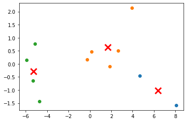

# KMeans Clustering using SKLearn


*Created By: Debasis Das (26-Aug-2021)*

Using SKLearn to explore KMeans Clustering and Plotting the cluster centroids along with the cluster points


```python
import pandas as pd
import numpy as np
from sklearn.cluster import KMeans
from sklearn.decomposition import PCA
import matplotlib.pyplot as plt


A = [
[10,10],
[11,10],
[12,10],
[10,11],
[15,17],
[13.5,15],
[15,16],
[17,18],
[14.5,19],
[20,20],
[13.5,14.5]
]

df = pd.DataFrame(A)
number_clusters = 3
pca = PCA(n_components=2) 
pca.fit(df)
x_pca = pca.fit_transform(df)
km = KMeans(
    n_clusters=number_clusters, init='random',
    n_init=10, max_iter=300, 
    tol=1e-04, random_state=0
).fit(x_pca)


kmeans_labels = km.labels_
unique_labels = np.unique(kmeans_labels)
for i in unique_labels:
    plt.scatter(
        x_pca[kmeans_labels == i, 0], x_pca[kmeans_labels == i, 1]
    )
cluster_centroids = km.cluster_centers_
print("cluster_centroids = ",cluster_centroids)
print("kmeans_labels = ",kmeans_labels)
plt.scatter(cluster_centroids[:,0], cluster_centroids[:,1],linewidths = 3, s=150,marker="x", color='r')


```

    cluster_centroids =  [[ 6.38423083 -1.0142913 ]
     [ 1.67176795  0.63576739]
     [-5.28182536 -0.28756359]]
    kmeans_labels =  [2 2 2 2 1 1 1 0 1 0 1]

    <matplotlib.collections.PathCollection at 0x7fef5a604c40>

    
