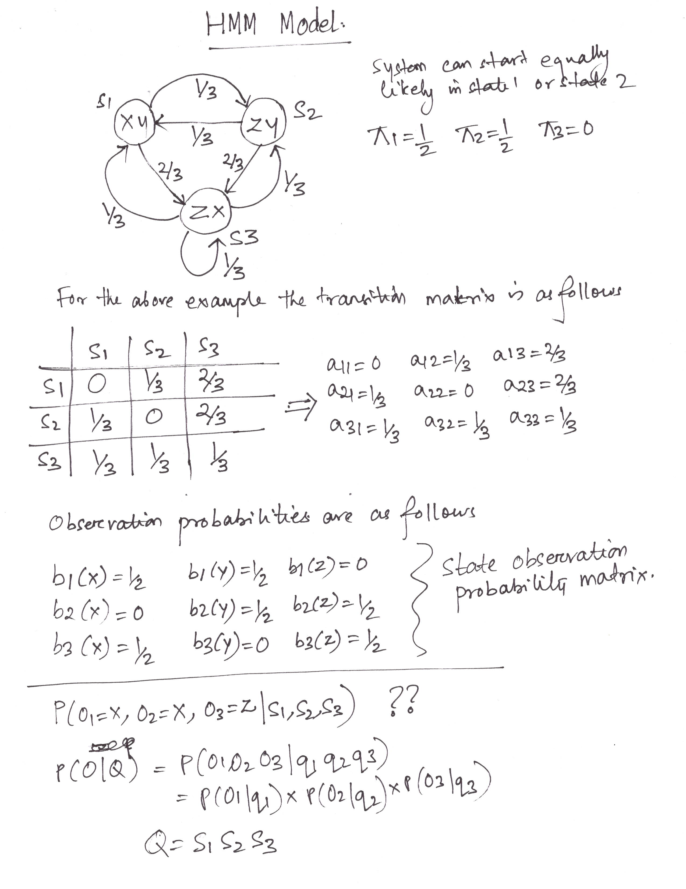
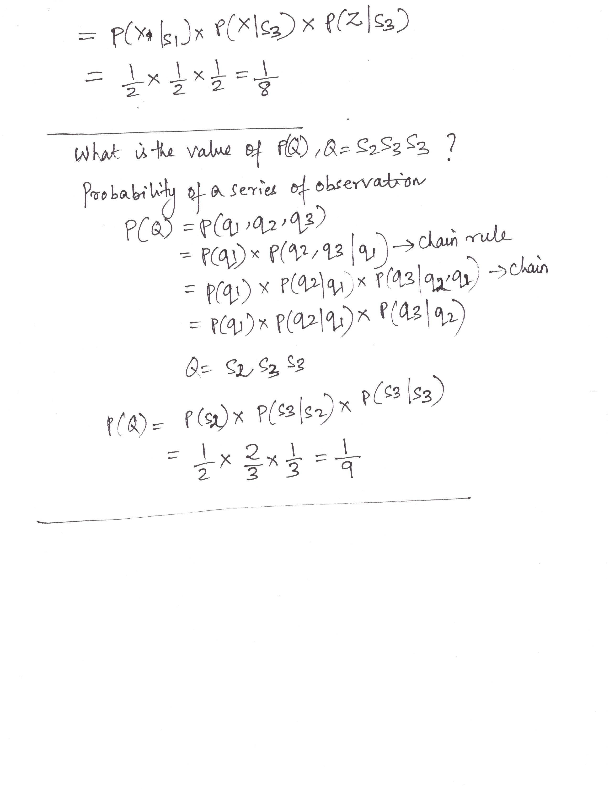

# Markov Chain

## HMM Model (Hidden Markov Model)

*Created By: Debasis Das (11-Sept-2021)*

* A Markov System has N states, called s1, s2 .. sN
* There are discrete timesteps, t=0, t=1, …
* On the t’th timestep the system is in exactly one of the available states. Call it qt
* Note: qt ∈{s1, s2 .. sN }
* Between each timestep, the next state is chosen randomly.
* The current state determines the probability distribution for the next state (noted as arcs between states)

