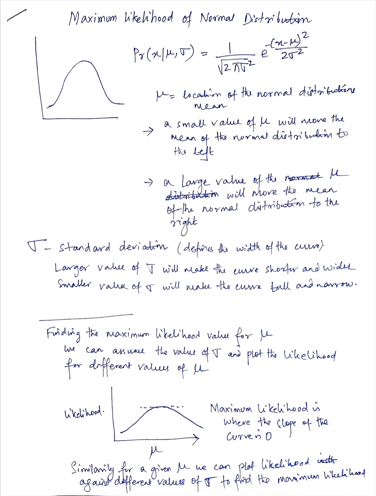
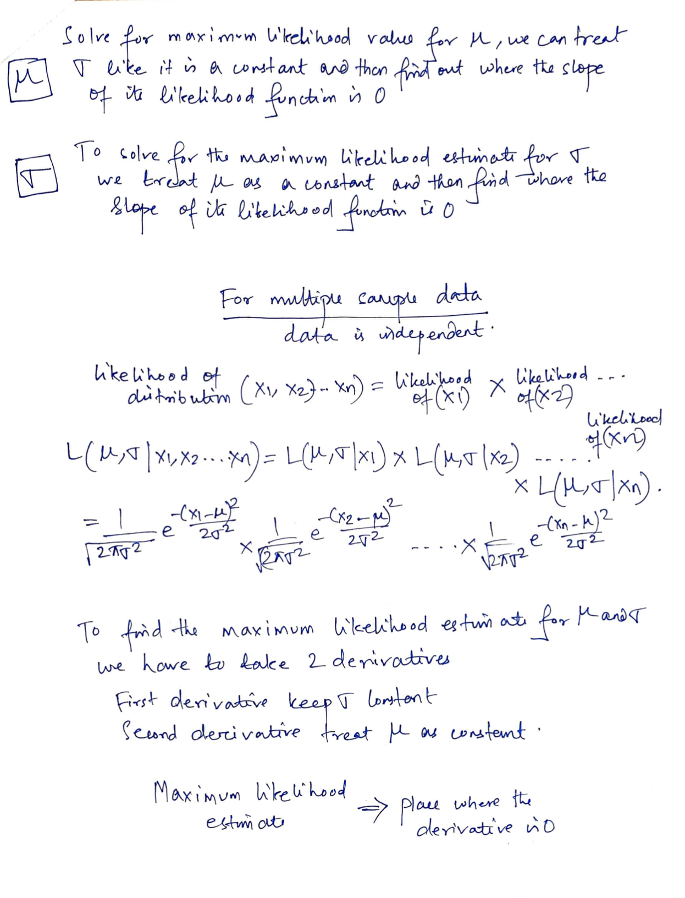
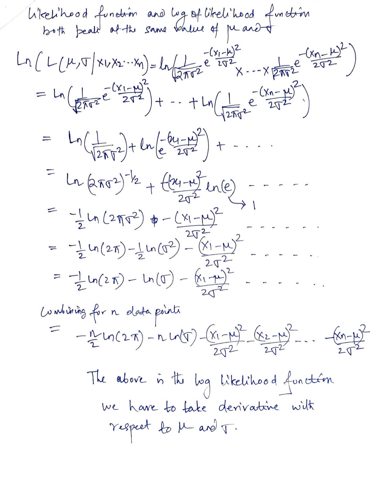
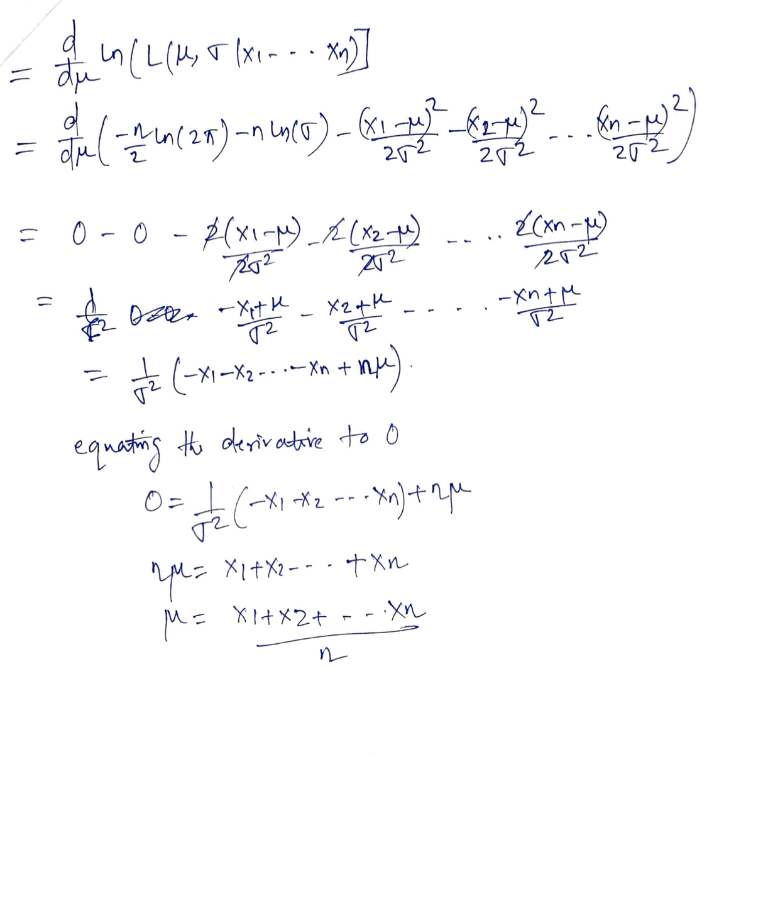
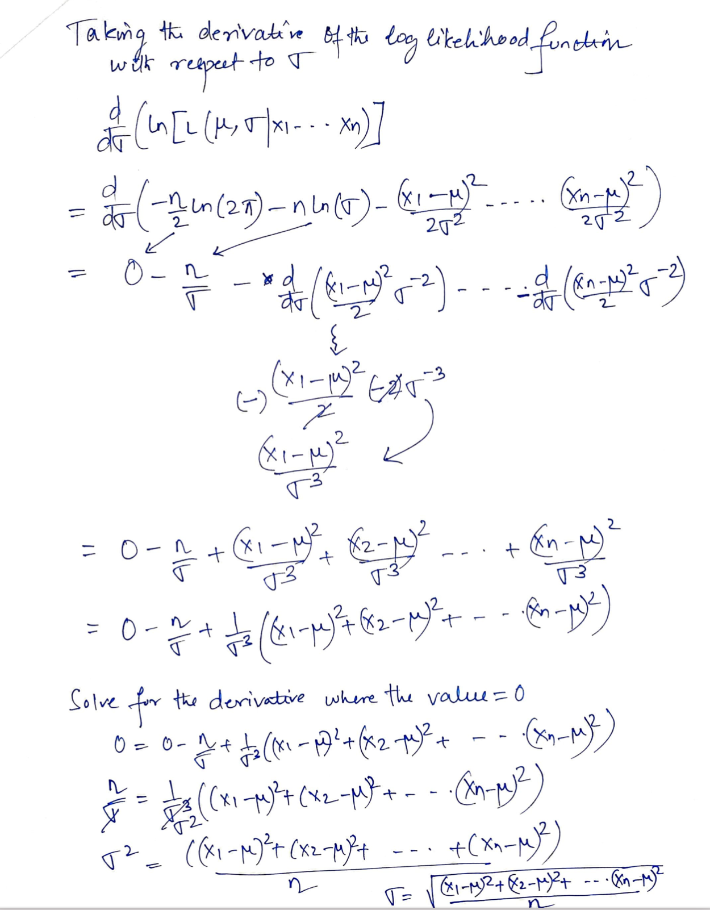
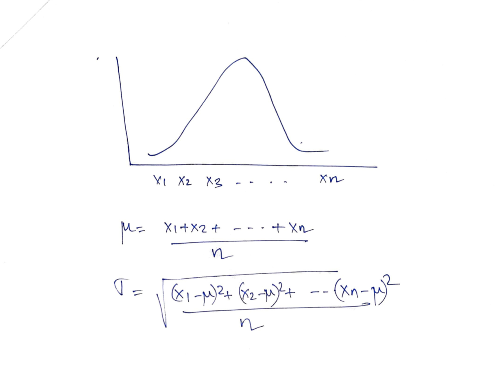

# Maximum Likelihood for Normal Distribution

*Added By (Debasis Das - 27-Aug-2021)*

Notes taken from 

[StatQuest: Maximum Likelihood, clearly explained!!!](https://www.youtube.com/watch?v=XepXtl9YKwc)

[Maximum Likelihood For the Normal Distribution, step-by-step!](https://www.youtube.com/watch?v=Dn6b9fCIUpM)

